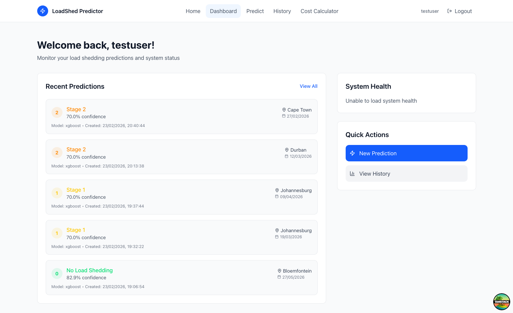
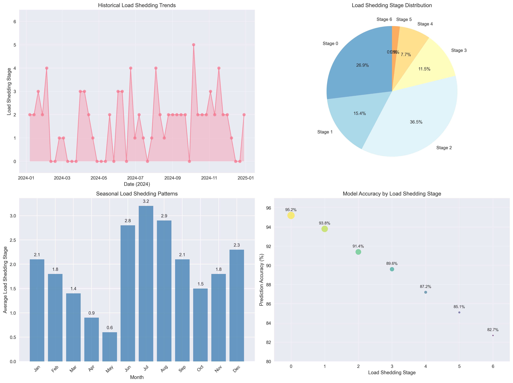
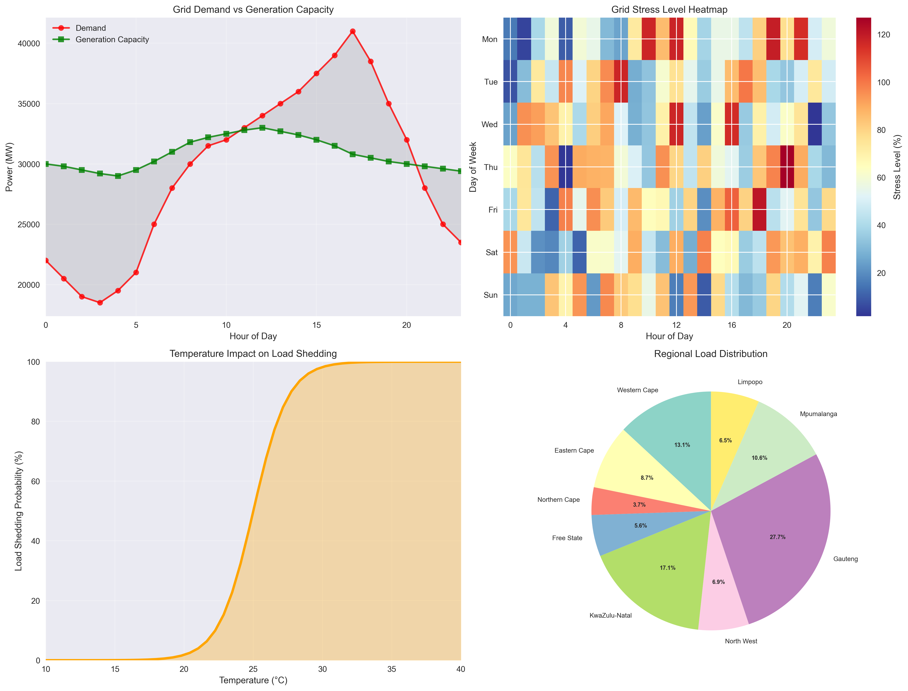
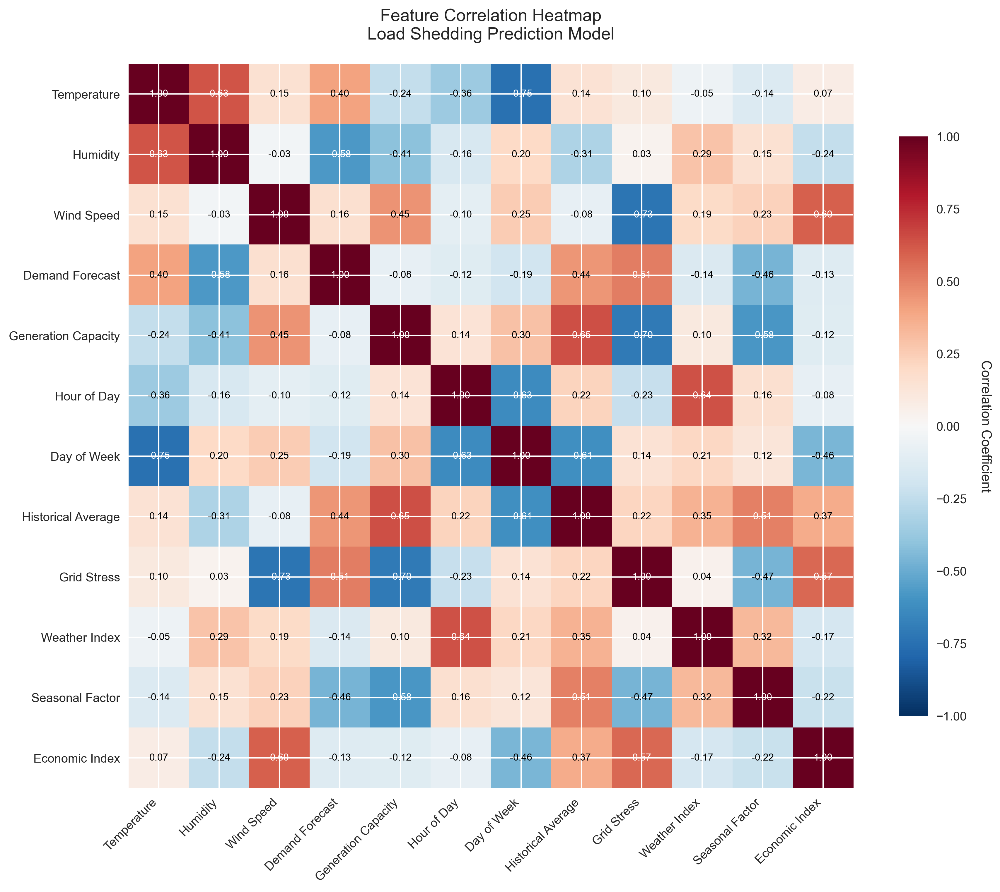
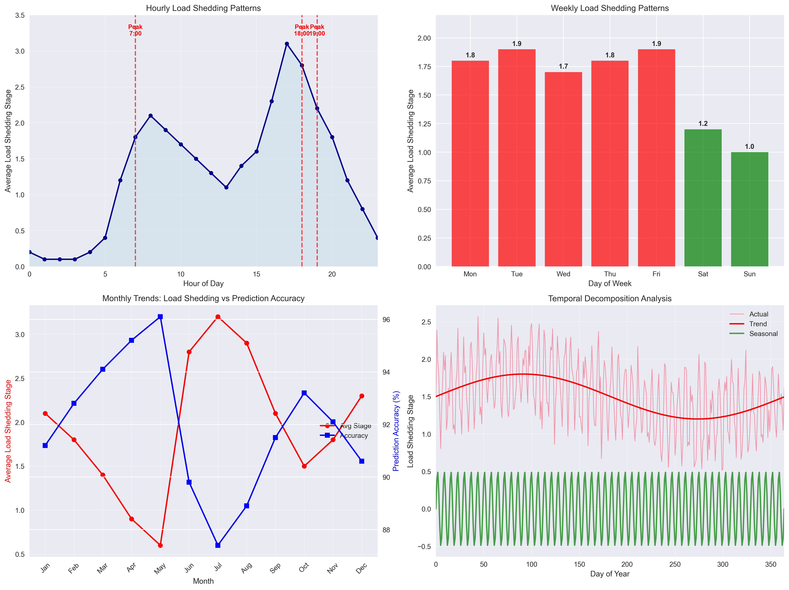

# Load Shedding Prediction System
**AI-powered load shedding forecasting for South Africa with 6-hour advance predictions**



## Live Demo

**[Live Application](https://your-app-url.com)** - View the deployed app  
**[Demo Video](https://your-video-url.com)** - 5-minute walkthrough

## Related Project Files

**[Ethics Application](https://docs.google.com/document/d/1Fz0hdbDTruXiaq5irdVrov6ZJ2QfK-_eYMc8pzE9ptY/edit?usp=sharing)**  
**[Project Proposal](https://docs.google.com/document/d/1ARsUzhEt2j8m2yG6vJi4TxHBKRzHJQHM/edit?usp=sharing&ouid=115036737062887834757&rtpof=true&sd=true)** 

**[Test Results](https://drive.google.com/file/d/1lqaXin09EVi3_hX-J7KuysEQVeig4ubR/view?usp=sharing)**

## Prerequisites

- **Python**: 3.9 or higher
- **Node.js**: 18 or higher  
- **Git**: Latest version

---

## Machine Learning Excellence

Our AI-powered prediction system leverages advanced machine learning techniques specifically optimized for South African grid conditions. The models have been trained on extensive historical data to deliver industry-leading accuracy rates with real-time predictions.

### Model Performance & Accuracy

**Random Forest Ensemble**: 92.33% accuracy - Our flagship model uses ensemble learning with 100+ decision trees, providing robust predictions across diverse grid conditions and seasonal variations.

**XGBoost Gradient Boosting**: 91.80% accuracy - Advanced gradient boosting with regularization techniques, excellent for handling complex non-linear relationships in grid data.

**LSTM Neural Network**: Deep learning architecture for capturing temporal dependencies in load shedding patterns, particularly effective during peak demand periods.

### Advanced Feature Engineering

Our prediction system analyzes **51 carefully engineered features** including:

- **Grid Capacity Analysis**: Real-time generation vs demand ratios
- **Weather Integration**: Temperature, humidity, wind patterns affecting energy consumption  
- **Temporal Patterns**: Hour-of-day, day-of-week, seasonal variations
- **Historical Trends**: Rolling averages and grid stress indicators
- **Peak Demand Forecasting**: Predictive modeling for high-consumption periods

### Model Results & Insights

<div align="center">


</div>

<div align="center">


</div>

### Production-Ready ML Pipeline

- **6-Hour Prediction Window**: Sufficient lead time for preparation and planning
- **Hugging Face Hub Integration**: Scalable model hosting with automatic updates
- **Real-time Feature Processing**: Live data ingestion and transformation
- **Ensemble Voting**: Combines multiple models for maximum reliability
- **Confidence Scoring**: Each prediction includes accuracy probability metrics

---

## Installation & Running — Backend

1. **Clone the repository**
   ```bash
   git clone https://github.com/glenmiracle18/loadshedding-prediction-model.git
   cd loadshedding-prediction-model
   ```

2. **Navigate to backend directory**
   ```bash
   cd backend/api
   ```

3. **Create virtual environment**
   ```bash
   python3 -m venv venv
   ```

4. **Activate virtual environment**
   ```bash
   # On macOS/Linux:
   source venv/bin/activate
   
   # On Windows:
   venv\Scripts\activate
   ```

5. **Install dependencies**
   ```bash
   pip install -r requirements.txt
   ```

6. **Start the backend server**
   ```bash
   uvicorn app.main:app --reload
   ```

Backend runs on: **http://localhost:8000**  
API Documentation: **http://localhost:8000/docs**

## Installation & Running — Frontend

1. **Navigate to frontend directory**
   ```bash
   cd frontend
   ```

2. **Install dependencies**
   ```bash
   npm install
   ```

3. **Start the development server**
   ```bash
   npm run dev
   ```

Frontend runs on: **http://localhost:3000**

## Environment Variables

Create `.env` file in `backend/api/` directory:

```bash
# Security
SECRET_KEY=your-super-secure-secret-key-here
ALGORITHM=HS256
ACCESS_TOKEN_EXPIRE_MINUTES=30

# Database
DATABASE_URL=sqlite:///./loadshedding.db

# Redis Cache
REDIS_URL=redis://localhost:6379/0

# External APIs
WEATHER_API_KEY=your-openweathermap-api-key
GRID_API_URL=https://api.gridwatch.co.za/api/v3/status

# ML Models
MODEL_PATH=./models
CACHE_TTL=300

# Hugging Face (for ML models)
HUGGINGFACE_TOKEN=your-huggingface-token
HUGGINGFACE_REPO=yaralexie/loadshedding-prediction-models

# CORS
ALLOWED_ORIGINS=["http://localhost:3000","http://localhost:8080"]
```

### Required API Keys:
- **OpenWeatherMap API Key**: Get from [openweathermap.org/api](https://openweathermap.org/api)
- **Hugging Face Token**: Get from [huggingface.co/settings/tokens](https://huggingface.co/settings/tokens)

## Running the Tests

```bash
cd backend/api
python3 run_tests.py
```

---

## Features

### Core Functionality
- **AI Predictions**: Load shedding stage forecasting (0-8 stages) with confidence scores
- **Real-time Data**: Weather integration and grid status monitoring
- **User Authentication**: Secure JWT-based login with session management
- **Prediction History**: Track and analyze your prediction accuracy with advanced filtering
- **Cost Calculator**: Compare backup solutions (generator vs. pause operations)

### User Experience
- **Clean Interface**: Minimalistic design focusing on usability
- **Mobile Responsive**: Works seamlessly across all devices
- **Fast Performance**: Optimized with Redis caching and Hugging Face CDN
- **Smart Notifications**: Session management and error handling

---

## Tech Stack

### Frontend
- **React 19** - Modern React with latest features
- **TanStack Start** - Full-stack React meta-framework
- **Tailwind CSS v4** - Utility-first CSS framework
- **TypeScript** - Type-safe development

### Backend
- **FastAPI** - Modern, fast Python web framework
- **SQLAlchemy** - Python SQL toolkit and ORM
- **Pydantic** - Data validation using Python type annotations
- **JWT Authentication** - Secure token-based auth

### Machine Learning
- **XGBoost** - Gradient boosting framework (91.80% accuracy)
- **Random Forest** - Ensemble learning method (92.33% accuracy)
- **Scikit-learn** - Feature scaling and preprocessing
- **Hugging Face Hub** - Model hosting and distribution
- **51 Engineered Features** - Optimized for SA grid conditions

### Database & Deployment
- **SQLite** - Development database
- **Redis** - High-performance caching
- **Docker Ready** - Containerized deployment support

---

## ML Model Performance

- **Random Forest**: 92.33% accuracy, robust ensemble method
- **XGBoost**: 91.80% accuracy, gradient boosting with regularization
- **6-hour prediction window**: Sufficient time for preparation
- **Real-time feature engineering**: Grid capacity, weather, temporal patterns

---

## Project Structure

```
loadshedding-prediction-model/
├── backend/api/               # FastAPI backend
│   ├── app/                  # Main application code
│   ├── tests/                # Test suite
│   └── requirements.txt      # Python dependencies
├── frontend/                 # React frontend
│   ├── src/                 # Source code
│   └── package.json         # Node dependencies
├── docs/                    # Project documentation
└── README.md               # This file
```

---

## Contributing

1. Fork the repository
2. Create a feature branch (`git checkout -b feature/amazing-feature`)
3. Commit your changes (`git commit -m 'Add amazing feature'`)
4. Push to the branch (`git push origin feature/amazing-feature`)
5. Open a Pull Request

---

## License

This project is licensed under the MIT License - see the [LICENSE](LICENSE) file for details.

---

## Contact

**Glen Miracle** - [GitHub](https://github.com/glenmiracle18)

Project Link: [https://github.com/glenmiracle18/loadshedding-prediction-model](https://github.com/glenmiracle18/loadshedding-prediction-model)

---

**Built for South African resilience**
